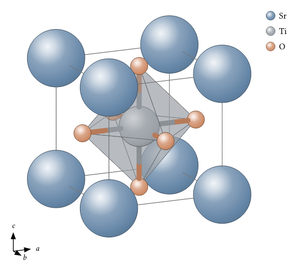
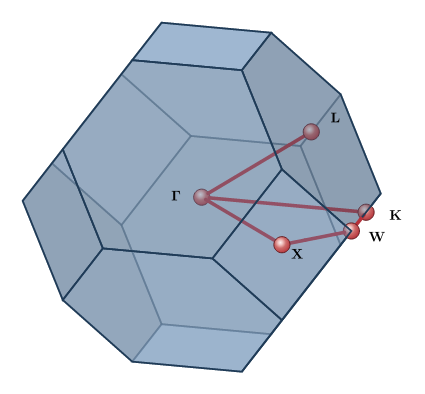

# scenery

[](https://github.com/GiggleLiu/scenery/actions/workflows/ci.yml)

Native scientific visualization for [Typst](https://typst.app), organized as a
shared scene core plus a materials-science toolkit. Figures stay as vector
content and compile without a Python rendering step.

<table>
<tr>
<td align="center"><a href="scenery/examples/hero.typ"></a><br><code>scenery</code>: shared 2D/3D scene core</td>
<td align="center"><a href="materia/examples/perovskite.typ"></a><br><code>materia</code>: real-space structures</td>
</tr>
<tr>
<td align="center"><a href="materia/examples/fcc-bz.typ"></a><br><code>materia</code>: reciprocal space</td>
<td align="center"><a href="materia/examples/co-mo.typ"></a><br><code>materia</code>: electronic structure</td>
</tr>
</table>

## Packages

| Package | Purpose | Version |
| --- | --- | --- |
| [`scenery`](scenery/) | Typed 2D/3D primitives, cameras, depth sorting, themes, transforms, annotations, and vector rendering through CeTZ. | 0.1.0 |
| [`materia`](materia/) | Crystal/molecular structures, file import, Brillouin zones, k-paths, band panels, and declarative molecular-orbital diagrams. | 0.1.0 |

`materia` builds on `scenery`. The stable composable boundaries are
`crystal-scene`, `bz-scene`, and `mo-scene`, each returning an ordinary
`scenery` scene dictionary.

## Quick start

```typst
#import "@preview/scenery:0.1.0": build-scene, sphere, seg, camera, render-scene

#let scene = build-scene(
  sphere((0, 0, 0), 0.6),
  sphere((2, 0, 0), 0.6, color: rgb("#dd8452")),
  seg((0, 0, 0), (2, 0, 0)),
)
#render-scene(scene, camera(azimuth: 30deg, elevation: 20deg), width: 5cm)
```

```typst
#import "@preview/materia:0.1.0": prototypes, crystal, bz-figure

#crystal(prototypes.rocksalt("Na", "Cl", a: 5.64), width: 7cm)
#bz-figure((a: 3.61), bravais: "cF", width: 6cm)
```

See the package READMEs for the complete [scene-core API](scenery/README.md) and
[materials toolkit API](materia/README.md).

## Development

```bash
make test       # link local packages and run all tests
make examples   # compile all integration examples
make manual     # build the scenery manual
make plugin     # rebuild both bundled WASM plugins
```

See [`docs/DEVELOPMENT.md`](docs/DEVELOPMENT.md) for local package resolution
and [`docs/plans/2026-07-14-materia-package-design.md`](docs/plans/2026-07-14-materia-package-design.md)
for the merge and API design.

## License

MIT — see [LICENSE](LICENSE). Third-party materials-data provenance is recorded
in [`materia/NOTICE`](materia/NOTICE).
