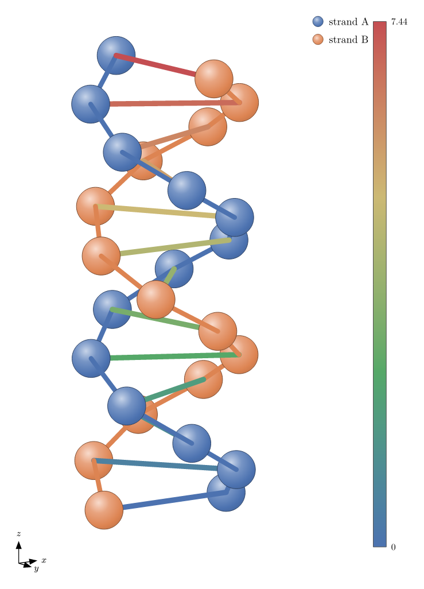
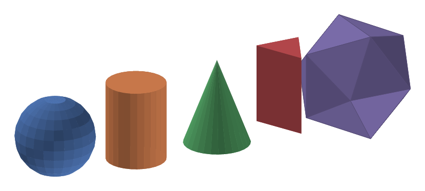
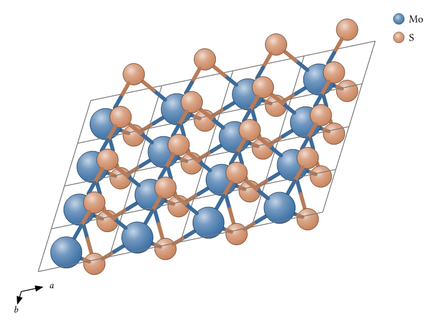

# scenery

[](https://github.com/GiggleLiu/scenery/actions/workflows/ci.yml)

Scientific visualization for [Typst](https://typst.app) — a family of packages built on one shared 2D/3D scene core. Describe a figure as typed primitives, and scenery projects, depth-sorts, and paints it with [CeTZ](https://typst.app/universe/package/cetz), entirely inside the compiler: no Python, no raster step, native vector output.

**[Download the manual (PDF)](https://github.com/GiggleLiu/scenery/releases/latest/download/scenery-manual.pdf)**

## Gallery

<table>
<tr>
<td align="center"><a href="scenery/examples/hero.typ"></a><br>3D scene core — spheres, bonds, legend, colorbar, axes triad</td>
<td align="center"><a href="wyckoff/examples/perovskite.typ"></a><br>SrTiO&#8323; perovskite with TiO&#8326; octahedra (<code>wyckoff</code>)</td>
</tr>
<tr>
<td align="center"><a href="scenery/examples/solids.typ"></a><br>Parametric solids and convex-hull polyhedra</td>
<td align="center"><a href="wyckoff/examples/mos2.typ"></a><br>MoS&#8322; monolayer from layer group p-6m2 (<code>wyckoff</code>)</td>
</tr>
</table>

## Packages

| Package | What it does | Status |
| --- | --- | --- |
| [`scenery`](scenery/) | The shared scene core: typed 2D/3D primitives, orthographic camera, painter's depth sort, themes, annotations. Typst's first programmatic 3D API. | 0.1.0 |
| [`wyckoff`](wyckoff/) | Materials Project style crystal-structure figures from space groups, layer groups, and Wyckoff positions. | 0.1.0 |
| `brillouin` | Brillouin zones, high-symmetry k-paths, and band-path panels. | [in progress](https://github.com/GiggleLiu/scenery/milestone/2) |

More packages (tensor networks, lattice models, phase portraits, …) are tracked on the [roadmap](https://github.com/GiggleLiu/scenery/issues/17). Every package must fill a real gap on Typst Universe, serve a demonstrated need, and build on the shared core.

## Quick start

A 3D scene in four lines:

```typst
#import "@preview/scenery:0.1.0": build-scene, sphere, seg, camera, render-scene

#let scene = build-scene(
  sphere((0, 0, 0), 0.6),
  sphere((2, 0, 0), 0.6, color: rgb("#dd8452")),
  seg((0, 0, 0), (2, 0, 0)),
)
#render-scene(scene, camera(azimuth: 30deg, elevation: 20deg), width: 5cm)
```

A crystal from its space group:

```typst
#import "@preview/wyckoff:0.1.0": structure, crystal

#let nacl = structure(
  spacegroup: 225,
  lattice: (a: 5.64),
  sites: ((element: "Na", wyckoff: "a"), (element: "Cl", wyckoff: "b")),
)
#crystal(nacl, bonds: auto, legend: true, axes: true, width: 8cm)
```

Each package README ([scenery](scenery/README.md), [wyckoff](wyckoff/README.md)) has the full API reference and gallery.

## Development

```bash
make test       # run every package's test suite
make examples   # compile every package's examples
make manual     # build the scenery manual PDF
```

See [`docs/DEVELOPMENT.md`](docs/DEVELOPMENT.md) for the monorepo layout and how `@preview` imports resolve against the local checkout. The [product design](docs/design/scenery.md) records the architecture and the admission rules for new packages.

## License

MIT — see [LICENSE](LICENSE).
