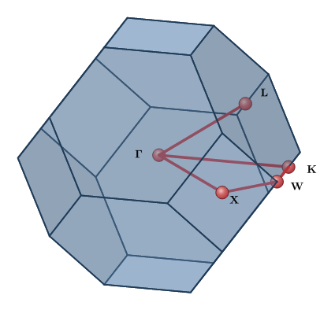
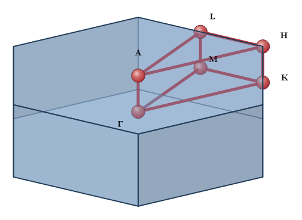
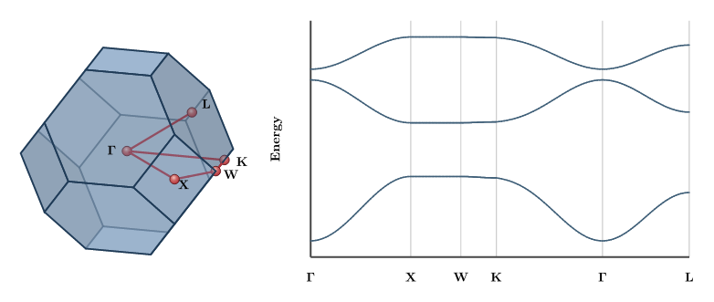

# brillouin

[](https://github.com/GiggleLiu/scenery/actions/workflows/ci.yml)

Brillouin zones, high-symmetry k-paths and band-path panels for [Typst](https://typst.app) — the reciprocal-space companion to [wyckoff](https://typst.app/universe/package/wyckoff). Give a lattice (crystal-system parameters, primitive vectors, or a `wyckoff` structure) and a Bravais symbol; `brillouin` builds the first Brillouin zone as the Wigner–Seitz cell of the reciprocal lattice, looks up the Setyawan–Curtarolo (2010) high-symmetry points and recommended path, and draws the classic textbook figure — a translucent zone polyhedron with the k-path traced on it and its points labelled Γ, X, W, … — entirely inside the compiler, no external tools. An optional flat band-path panel plots your dispersion arrays against distance along the path. The 3D drawing rides on the shared [scenery](https://typst.app/universe/package/scenery) scene core.

<table>
<tr>
<td align="center"><a href="examples/fcc-bz.typ"></a><br>fcc zone (truncated octahedron), Γ–X–W–K–Γ–L path</td>
<td align="center"><a href="examples/hexagonal-bz.typ"></a><br>hexagonal (hP) zone</td>
</tr>
<tr>
<td align="center" colspan="2"><a href="examples/bz-band.typ"></a><br>Zone beside a band panel — fcc tight-binding bands along the path</td>
</tr>
</table>

The sources for these figures are in [`examples/`](examples/).

## Quick start

```typst
#import "@preview/brillouin:0.1.0": bz-figure

#bz-figure((a: 3.61), bravais: "cF", path: ("Γ", "X", "W", "K", "Γ", "L"), width: 8cm)
```

That is the complete source of the fcc figure above: parameters in, figure out. The `bravais:` symbol selects the SC-2010 k-point table **and** the correct primitive cell — for centered lattices this matters, since the first Brillouin zone is the Wigner–Seitz cell of the *primitive* reciprocal lattice (the conventional cubic cell's reciprocal would draw a cube, not a truncated octahedron). Passing three vectors instead treats them as the primitive cell directly. (The examples in this repository import `/lib.typ` so they run against the working tree; in your own documents use the `@preview` import shown here.)

**Import names explicitly — never `#import "@preview/brillouin:0.1.0": *`.** Like `scenery`, the package re-exports names such as `kpath` that could shadow your own bindings.

## `bz-figure()` options

```typst
#bz-figure(lattice, ..options)
```

| Option | Default | Meaning |
| --- | --- | --- |
| `bravais` | `auto` | Extended Bravais base symbol (cP, cF, cI, tP, tI, oP, oF, oI, oC, hP, hR, mP, aP). Required to draw a k-path. |
| `view` | `(azimuth: 30deg, elevation: 20deg)` | Camera orientation (orthographic). |
| `kpath` | `true` | Draw the recommended path and its k-points. |
| `klabels` | `true` | Draw pretty Greek labels at each k-point. |
| `highlight` | `()` | Point names to emphasize (larger gold markers); an unknown name is a clear error. |
| `path` | `auto` | Override the drawn path with a connected name sequence, e.g. `("Γ", "X", "W", "K", "Γ", "L")`. |
| `params` | `auto` | Explicit k-path parameters when `lattice` is not a parameter dict. |
| `width` | `6cm` | Rendered width. |
| `theme` | `scenery.default-theme` | A `scenery` theme. |

`bz-group()` takes the same arguments but `scale:` instead of `width:`, returning raw [cetz](https://typst.app/universe/package/cetz) draw calls so you can place the zone inside a larger canvas alongside your own annotations.

### Lattice input

`lattice` accepts three shapes:

- **crystal-system parameters** — a dict with `a`, `b`, `c` (Å) and `alpha`, `beta`, `gamma` (angles), in the SC-2010 standard setting. Pair with `bravais:` so the primitive cell and k-points are correct. This is the usual route.
- **three primitive direct vectors** — an array of three 3-vectors (Å), taken *as* the primitive cell (no centering transform). Use this for `mC` and any cell you already have in primitive form.
- **a `wyckoff` structure** — its conventional `vectors` are read (soft dependency; `brillouin` never imports `wyckoff`). A structure carries no Bravais symbol, so its k-path cannot be drawn; use it for the bare zone of primitive (P) lattices, or pass `bravais:`/`params:` explicitly.

## Band panel

`band-panel` is a modest 2D companion drawn through `scenery`'s flat mode — dispersion curves against distance along the path, with high-symmetry ticks. It takes **your** energy arrays; `band-axis` builds the matching distance axis and Cartesian sample points:

```typst
#import "@preview/brillouin:0.1.0": band-axis, band-panel

#let ax = band-axis("cF", (a: 3.61), ("Γ", "X", "W", "K", "Γ", "L"), samples: 40)
#let bands = (
  ax.carts.map(k => my-lower-band(k)),
  ax.carts.map(k => my-upper-band(k)),
)
#band-panel(bands, ax, width: 8cm, height: 5cm)
```

`band-axis` returns `(k-dists:, carts:, ticks: (positions:, labels:))`; `band-panel` reads `k-dists` and `ticks` (the extra `carts` is yours to evaluate energies on). For serious plotting — proper axes, ticks, legends — reach for [lilaq](https://typst.app/universe/package/lilaq) and feed it the same arrays.

## API reference

Grouped by module; every name is exported from the package root.

`brillouin-version` is the package version as a Typst `version` value.

### Reciprocal lattice — `reciprocal.typ`

| Name | Description |
| --- | --- |
| `reciprocal-vectors(direct)` | Reciprocal vectors (2π convention) from three direct vectors or a parameter dict. |
| `params-to-vectors(params)` | Conventional direct vectors from crystal-system parameters (matches `wyckoff`). |
| `from-wyckoff(structure)` | Reciprocal vectors from a `wyckoff` structure's `vectors` (soft dependency). |

### First Brillouin zone — `wigner-seitz.typ`

| Name | Description |
| --- | --- |
| `bz-cell(recip)` | The zone as `(vertices, faces)`, directly a `scenery.mesh`; `none` if degenerate. |
| `bz-volume(cell)` | Enclosed volume — an invariant equal to \|det(b1,b2,b3)\|. |

### High-symmetry k-paths — `kpath.typ`

| Name | Description |
| --- | --- |
| `kpath-data(bravais, params)` | `(points:, path:, variant:)` — points fractional in the primitive reciprocal basis. |
| `kpoints(bravais, params)` | Just the named high-symmetry points. |
| `kpath(bravais, params)` | Just the recommended path (array of name pairs). |

### Figures — `figure.typ`

| Name | Description |
| --- | --- |
| `bz-figure(lattice, ..)` | The zone polyhedron + labelled k-points + traced path, as content. |
| `bz-group(lattice, .., scale:)` | The same scene as raw cetz draw calls. |
| `band-axis(bravais, params, points, samples:)` | Distance axis + Cartesian samples + ticks for a connected k-point chain. |
| `band-panel(bands, path-points, ..)` | A flat band-structure panel from your energy arrays. |
| `pretty-klabel(name)` | HPKOT name → display string (`GAMMA` → Γ, `X_1` → X₁, `DELTA_0` → Δ₀). |

## Labels and coordinates: HPKOT vs SC-2010

The k-point **labels** follow the HPKOT standardization (Hinuma et al. 2017) as implemented by [seekpath](https://github.com/materialscloud-org/seekpath) — Greek interior points are named `SIGMA_0`, `DELTA_0`, … and `pretty-klabel` renders them Σ₀, Δ₀, …. The **coordinates** are Setyawan & Curtarolo's (2010): HPKOT reproduces SC-2010's primitive-cell choice for every Bravais type, so for the point names the two conventions share (Γ, X, W, L, U, K, …) the fractional coordinates are identical to SC-2010's. Where they differ — the *labels* of a few centered-lattice interior free points, and a handful of recommended path segments — the k-path fixtures record it per case. This package returns the centrosymmetric path variants (cP2, cF2, hP2, …); the extra segment of the non-centrosymmetric variants is not selected, since the API takes only a Bravais symbol.

## Limitations

- **Standardized cells only.** Formulas are evaluated on the SC-2010 standardized conventional cell (orthorhombic a ≤ b ≤ c, monoclinic unique axis b with β ≥ 90°, hexagonal setting for hR). Pass parameters in that setting.
- **No Niggli reduction.** Triclinic (aP) variant selection assumes an already-reduced cell (its reciprocal cell all-acute or all-obtuse); a non-reduced aP cell raises an error rather than silently mislabelling. Reduce it first.
- **mC from parameters is not supported.** Base-centered monoclinic has no closed-form primitive cell in this layer; pass its primitive vectors directly as `lattice`.
- **Painter's algorithm.** The zone is translucent, so intersecting faces can still order imperfectly. `scenery` splits path lines at face boundaries and renders rear zone edges more quietly, which keeps the standard zones legible without pretending to provide a z-buffer.
- **A companion panel, not a plotting library.** `band-panel` is deliberately minimal — no auto-ticked energy axis, no legends. Use [lilaq](https://typst.app/universe/package/lilaq) for publication plots.

## Roadmap

Further reciprocal-space and rendering enhancements are tracked in [issue #17](https://github.com/GiggleLiu/scenery/issues/17).

## Development

```bash
make test       # compile every test suite in tests/
make examples   # compile every example in examples/ (CI coverage)
make images     # render examples/*.typ to images/*.png at 144 ppi
make fixtures   # regenerate the reciprocal / k-path ground-truth fixtures
```

From the monorepo root, `make test` and `make examples` fan out across all packages and resolve local `@preview` imports via `TYPST_PACKAGE_PATH`.

## License

MIT — see [LICENSE](LICENSE).
