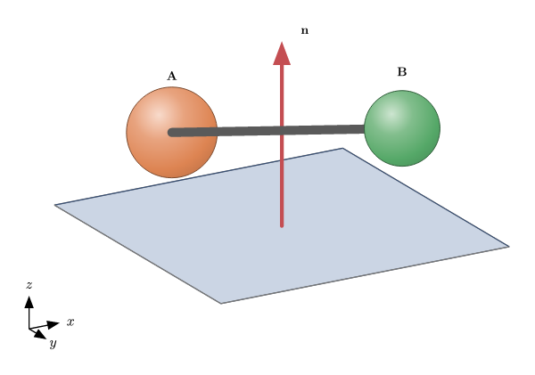
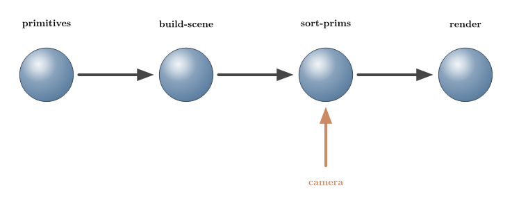

# scenery

[](https://github.com/GiggleLiu/scenery/actions/workflows/ci.yml)

Programmatic 3D (and 2D) scenes for [Typst](https://typst.app) — the missing 3D layer. Describe a figure as typed primitives (spheres, segments, arrows, faces, meshes, labels), pick an orthographic camera, and `scenery` projects, depth-sorts and paints the whole thing back-to-front with [CeTZ](https://typst.app/universe/package/cetz) — no external tools, no raster step, entirely inside the compiler. The same pipeline draws flat diagrams: `camera-2d()` passes coordinates straight through, so 2D figures and 3D scenes share one API.

**[Download the manual (PDF)](https://github.com/GiggleLiu/scenery/releases/latest/download/scenery-manual.pdf)** — a comprehensive, example-driven showcase of every capability, where each figure is generated by the exact code shown beside it. CI rebuilds the manual on every push (downloadable as the `scenery-manual` artifact from the run), and every tagged release attaches the PDF.

<table>
<tr>
<td align="center"><a href="examples/primitives.typ"></a><br>Primitive showcase — spheres, bonds, edges, an arrow, a translucent face, labels</td>
<td align="center"><a href="examples/solids.typ"></a><br>Parametric solids + a convex-hull icosahedron</td>
</tr>
<tr>
<td align="center"><a href="examples/flow.typ"></a><br>2D-mode flow graph via <code>camera-2d()</code></td>
<td align="center"><a href="examples/hero.typ"></a><br>Composite hero scene — axes triad, legend, colorbar</td>
</tr>
</table>

The sources for these figures are in [`examples/`](examples/).

## Quick start

```typst
#import "@preview/scenery:0.1.0": build-scene, sphere, seg, camera, render-scene

#let scene = build-scene(
  sphere((0, 0, 0), 0.6),
  sphere((2, 0, 0), 0.6, color: rgb("#dd8452")),
  seg((0, 0, 0), (2, 0, 0)),
)

#render-scene(scene, camera(azimuth: 30deg, elevation: 20deg), width: 5cm)
```

`build-scene` collects primitives into pure scene data; `render-scene` resolves any named anchors, projects through a `camera`, and paints at the requested on-page `width`. That is the whole loop. (The examples in this repository import `/lib.typ` directly so they run against the working tree; in your own documents use the `@preview` import shown here.)

### Named objects and anchors

Give a primitive a unique `name:` and use CeTZ-style `"object.anchor"` references in primitive coordinate parameters (`center`, `a`/`b`, `from`/`to`, vertices, and label `at`):

```typst
#let scene = build-scene(
  sphere((0, 0, 0), 0.6, name: "a"),
  sphere((2, 0, 0), 0.6, name: "b"),
  seg("a.east", "b.west", name: "bond"),
  label("bond.mid", [d], text-anchor: "south"),
)
```

References may point forward because the complete scene registry is resolved at render time. Sphere compass anchors are camera-relative points on the visible silhouette. Use `anchor-ref("a", anchor: 30deg)` for an angular sphere anchor, and `anchor-of(scene, camera, "bond.mid")` to query a concrete 3D point. Shape-generator inputs and affine transform parameters remain concrete vectors; references belong to the primitives those APIs produce or transform.

| Primitive | Default | Anchors |
| --- | --- | --- |
| `sphere` | `center` | `center`, compass directions; angles via `anchor-ref` |
| `seg`, `edge`, `arrow` | `mid` | `start`, `mid`, `end` |
| `face` | `centroid` | `centroid`, `vertex-0`, `vertex-1`, … |
| `mesh` | bounding-box `center` | `center`, `vertex-0`, `vertex-1`, … |
| `label` | `center` | attachment-point `center` |

Inside a shared `cetz.canvas`, `scene-group` registers these logical anchors with CeTZ, so later draw commands can directly use `"a.east"` or `"bond.mid"`. Names stay stable even when the renderer splits a line for occlusion.

### Imports

**Import names explicitly — never `#import "@preview/scenery:0.1.0": *`.** scenery exports `scale`, `label` and `group`, which would shadow Typst built-ins (`scale`, `label`) or common variables if wildcard-imported. Name exactly what you use, as in the quick start above. If you want scenery's `scale`/`label` alongside the built-ins, rename on import: `#import "@preview/scenery:0.1.0": scale as sscale, label as slabel`.

## How it works

A scene is a flat array of typed primitives — plain dictionaries tagged by `kind`, e.g. `(kind: "sphere", center: (0,0,0), r: 0.6)`. Nothing in the data model touches CeTZ. At render time named coordinates are resolved for the selected camera, then each primitive is projected orthographically. Segments and edges are split at opaque sphere silhouettes and their hidden intervals are removed; the remaining primitives are keyed by camera depth (spheres by centre, line fragments by midpoint, faces by centroid; meshes explode into per-face polygons that sort independently), sorted far-to-near, and drawn. Spheres use radial-gradient shading, faces are flat-shaded from one world light, and labels stay on top. Styling is a pure three-layer merge — theme defaults, per-kind block, then each primitive's own hooks — so colours and widths are just named arguments on the constructors.

## API reference

Grouped by source module; every name below is exported from the package root.

### Scene construction — `sphere`, `seg`, `edge`, `arrow`, `face`, `mesh`, `label`

| Name | Description |
| --- | --- |
| `sphere(center, r, name:, ..style)` | Shaded ball at `center` with radius `r`. |
| `seg(a, b, name:, ..style)` | Thick round-capped segment (e.g. a bond); width `w` in scene units. |
| `edge(a, b, name:, ..style)` | Thin wireframe edge (absolute stroke width). |
| `arrow(from, to, name:, ..style)` | Arrow with a scaled head (`head`, `w`). |
| `face(pts, name:, ..style)` | Filled planar polygon; `fill-opacity` for translucency. |
| `mesh(vertices, faces, name:, ..style)` | Indexed polygon mesh; each face sorts on its own. |
| `label(at, text, name:, ..style)` | Text at a 3D point; `text-anchor` controls alignment. |
| `build-scene(..prims)` | Flattens primitives/groups and validates object names. |

### Named coordinates — `anchor-ref`, `resolve-scene`, `anchor-of`, `anchor-names`

| Name | Description |
| --- | --- |
| `anchor-ref(name, anchor:)` | Explicit named-anchor coordinate, including angular sphere anchors. |
| `resolve-scene(scene, camera)` | Resolves every reference and camera-relative anchor to concrete geometry. |
| `anchor-of(scene, camera, reference)` | Returns one anchor as a concrete 3D point. |
| `anchor-names(scene, camera, name)` | Lists the named anchors available on an object. |

### Transforms — `affine`, `translate`, `scale`, `group`

| Name | Description |
| --- | --- |
| `affine(matrix:, offset:)` | Affine transform `p ↦ matrix·p + offset`. |
| `translate(v)` | Pure translation by `v`. |
| `scale(s)` | Uniform scale about the origin (positions only, not radii). |
| `group(transform, ..prims)` | Applies a transform to a bag of primitives/subgroups. |

### Camera — `camera`, `camera-2d`, `project`

| Name | Description |
| --- | --- |
| `camera(azimuth:, elevation:)` | Orthographic camera; `+z` is up at zero angles. |
| `camera-2d()` | Identity camera: `(x, y)` passes straight through. |
| `project(cam, point)` | Maps a 3-point to `(sx, sy, depth)`. |

### Shape generators — `hull-faces`, `uv-sphere`, `cylinder`, `cone`, `prism`

| Name | Description |
| --- | --- |
| `hull-faces(points)` | Convex-hull face records `(plane, vertices)`; `none` if degenerate. |
| `uv-sphere(center, r, segments:, rings:)` | UV-sphere mesh. |
| `cylinder(from, to, r, segments:, caps:)` | Cylinder mesh along an axis. |
| `cone(from, to, r, segments:, cap:)` | Cone mesh, base at `from`, apex at `to`. |
| `prism(base, extent, caps:)` | Polygon `base` extruded by `extent`. |

### Rendering — `render-scene`, `scene-group`, `sort-prims`

| Name | Description |
| --- | --- |
| `render-scene(scene, camera, width:, theme:, axes:, legend:, colorbar:)` | Renders a scene to Typst content at a target on-page width. |
| `scene-group(scene, camera, ..)` | Raw CeTZ commands; registers logical names for later `"object.anchor"` use. |
| `sort-prims(prims, camera)` | Pure depth-sort (far-to-near) with meshes exploded to faces. |

### Styling — `default-theme`, `resolve-style`, `palette-color`

| Name | Description |
| --- | --- |
| `default-theme` | Built-in theme: qualitative palette, light direction, per-kind defaults. |
| `resolve-style(theme, prim)` | Effective style for a primitive (defaults ← per-kind ← hooks). |
| `palette-color(theme, i)` | Palette colour `i`, wrapping around. |

### Annotation — `axes-triad`, `legend`, `colorbar`

| Name | Description |
| --- | --- |
| `axes-triad(camera, vectors, names:, ..)` | Labelled orientation triad (CeTZ commands). |
| `legend(entries, ..)` | Stacked `(label, color)` swatches with shaded balls. |
| `colorbar(colormap, range, ..)` | Vertical scalar colorbar with min/mid/max ticks. |

`render-scene`'s `axes:` / `legend:` / `colorbar:` options place these three automatically (triad bottom-left, legend and colorbar on the right), so the [hero example](examples/hero.typ) wires all three with a few named arguments.

### Linear algebra — `vadd`, `vsub`, `vscale`, `vdot`, `vcross`, `vlen`, `vnorm`, `mvec`, `lerp`

Small pure vector/matrix helpers (`mvec` is matrix·vector, `lerp` interpolates) shared by the geometry code and available for building your own primitives.

## Limitations

- **Orthographic only.** There is no perspective camera; parallel lines stay parallel and there is no foreshortening. This is the right projection for diagrams and technical figures, and the deliberate scope for now.
- **Painter's algorithm.** Faces and other unsplit primitives use one depth key, so intersecting translucent faces can occasionally be layered in the wrong order. Segments and edges are fragmented against opaque sphere silhouettes, but arbitrary polygon intersections are not split.
- **Practical size cap.** Everything runs in pure Typst, so compile time grows with primitive count. A few hundred to ~2,000 primitives is comfortable; tens of thousands are not.
- **Limited hidden-surface removal.** Opaque spheres clip hidden segment and edge intervals. Faces have no back-face culling or z-buffer; their occlusion still relies on painter ordering.

## Roadmap

Faster and larger scenes (a WASM geometry accelerator), a perspective camera, and richer meshes are tracked in [issue #17](https://github.com/GiggleLiu/scenery/issues/17).

## Development

```bash
make test       # compile every test suite in tests/
make examples   # compile every example in examples/ (CI coverage)
make images     # render examples/*.typ to images/*.png at 144 ppi
```

Run from the repo root, `make test` / `make examples` fan out across all packages and resolve the local `@preview/scenery:0.1.0` via `TYPST_PACKAGE_PATH` (see [`docs/DEVELOPMENT.md`](../docs/DEVELOPMENT.md)).

## License

MIT — see [LICENSE](LICENSE).
