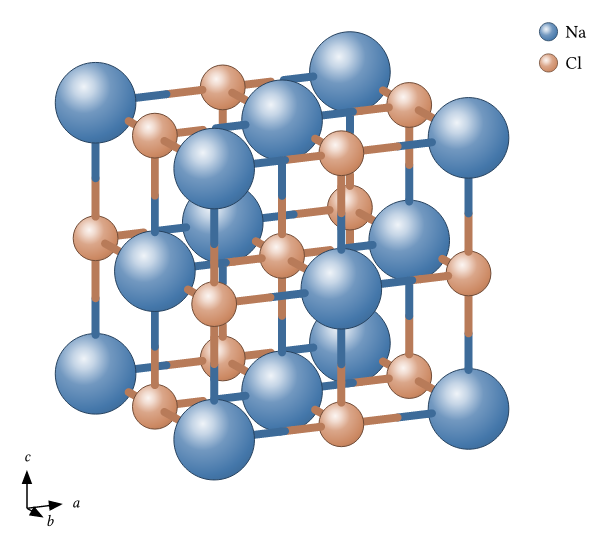
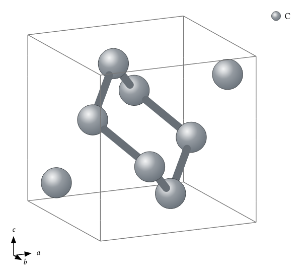
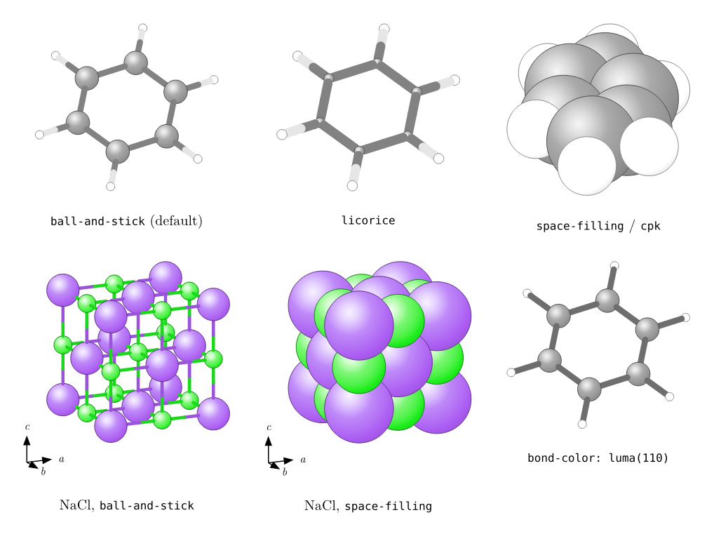
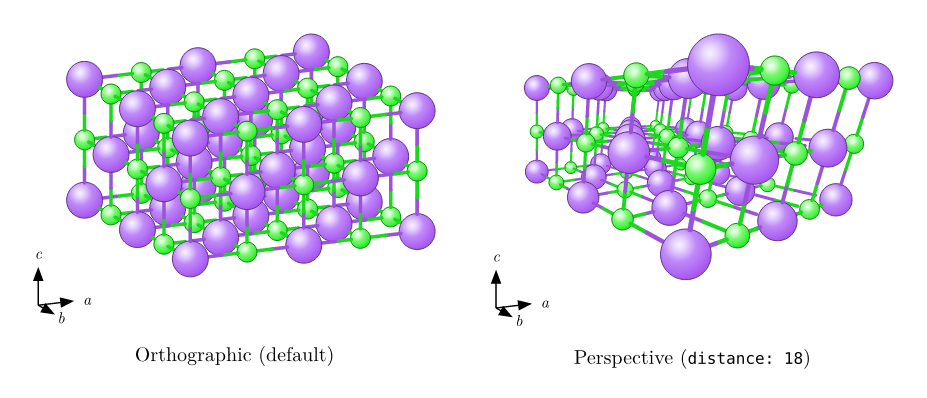

# wyckoff

Materials Project style crystal structure figures for [Typst](https://typst.app), specified the way crystallographers think: a space group (or layer group), Wyckoff positions, free coordinates, and lattice parameters. The package expands the symmetry, finds bonds and coordination polyhedra, and renders a shaded 3D ball-and-stick figure inside the Typst compiler, with bundled WASM plugins for file parsing and optional geometry acceleration.

<table>
<tr>
<td align="center"><br>NaCl (rocksalt, Fm-3m)</td>
<td align="center"><br>SrTiO&#8323; (perovskite, Pm-3m) with TiO&#8326; octahedra</td>
</tr>
<tr>
<td align="center"><br>Diamond (Fd-3m, origin choice 2)</td>
<td align="center"><br>MoS&#8322; monolayer (layer group p-6m2)</td>
</tr>
</table>

The sources for these figures are in [`examples/`](examples/).

## Quick start

```typst
#import "@preview/wyckoff:0.1.0": prototypes, crystal

#crystal(prototypes.rocksalt("Na", "Cl", a: 5.64), width: 8cm)
```

That is the complete source of the NaCl figure above. (The examples in this repository import `/lib.typ` directly so they run against the working tree; in your own documents use the `@preview` import shown here.)

The main API is `structure`, `crystal`, `crystal-group`, and `molecule`. The package also exports `import-xyz`, `import-poscar`, and `import-cif`, the ready-made `prototypes` module, and the `wyckoff-version` value.

## Specifying structures

`structure()` accepts exactly one of three input modes.

### Space group + Wyckoff positions

Give the space group number (1–230), the free lattice parameters for that crystal system, and one site per crystallographically distinct atom. Only the free parameters of each Wyckoff position are accepted — a fully fixed position like `4a` takes none, while e.g. position `4f` of rutile requires `x:`:

```typst
#import "@preview/wyckoff:0.1.0": structure, crystal

// Rutile TiO2: SG 136 (P4_2/mnm), Ti on 2a, O on 4f with free x
#crystal(structure(
  spacegroup: 136,
  lattice: (a: 4.594, c: 2.959),
  sites: (
    (element: "Ti", wyckoff: "a"),
    (element: "O",  wyckoff: "f", x: 0.305),
  ),
))
```

Passing a coordinate the position does not have, or omitting one it requires, is a compile error that lists the position's actual free variables.

This `(spacegroup, Wyckoff letters, free coordinates, lattice)` tuple is exactly the native representation used by [CrystalFormer](https://github.com/deepmodeling/CrystalFormer), so its generated structures can be dropped straight into `wyckoff` for rendering.

### Layer groups (2D materials)

All 80 layer groups are supported for atomically thin materials. In-plane coordinates are fractional as usual, but since a layer has no `c` period, **out-of-plane `z` is given in ångströms**, not as a fraction:

```typst
// 1H-MoS2: Mo on site 1b, S on 2f at z = +/-1.56 Angstrom
#crystal(prototypes.tmd("Mo", "S", a: 3.16, z: 1.56))
```

is shorthand for `structure(layergroup: 78, lattice: (a: 3.16), sites: ((element: "Mo", wyckoff: "b"), (element: "S", wyckoff: "f", z: 1.56)))`. Layer structures are drawn with a 2D cell grid and a two-axis (a/b) orientation triad.

### Explicit lattice + basis

When you already have expanded coordinates, skip symmetry entirely: pass three lattice vectors (in Å) and a list of `(element, fractional-position)` pairs.

```typst
#crystal(structure(
  lattice: ((3.57, 0, 0), (0, 3.57, 0), (0, 0, 3.57)),
  atoms: (
    ("C", (0.0, 0.0, 0.0)),
    ("C", (0.5, 0.5, 0.0)),
    ("C", (0.5, 0.0, 0.5)),
    ("C", (0.0, 0.5, 0.5)),
  ),
))
```

### Importing from files

`import-xyz(path)` reads an `.xyz` or extended-xyz file (parsed by the bundled
`wyckoff-io` WASM plugin) and returns a renderable structure. A plain `.xyz`
(Cartesian atoms, no lattice) becomes a molecule; extended-xyz with a
`Lattice="..."` header becomes a periodic cell.

```typst
#import "@preview/wyckoff:0.1.0": import-xyz, molecule
#molecule(import-xyz("water.xyz"))
```

`import-poscar(path)` reads a VASP 5 `POSCAR`/`CONTCAR` (element-symbols line
required; Direct or Cartesian coordinates; positive scale factor) and returns
a periodic structure.

```typst
#import "@preview/wyckoff:0.1.0": import-poscar, crystal
#crystal(import-poscar("POSCAR"))
```

`import-cif(path)` reads a CIF file (pragmatic subset). Symmetry is handled in
priority order: an explicit `_symmetry_equiv_pos_as_xyz` /
`_space_group_symop_operation_xyz` loop is applied directly (the path most
database exports take); otherwise a spacegroup identifier
(`_space_group_IT_number` or an H-M symbol) selects wyckoff's own tables to
expand the asymmetric unit; files with neither — like partial occupancy or
multi-block files — are rejected with an error naming the unsupported feature.

```typst
#import "@preview/wyckoff:0.1.0": import-cif, crystal
#crystal(import-cif("nacl.cif"))
```

## `crystal()` options

```typst
#crystal(structure, ..options)
```

| Option | Default | Meaning |
| --- | --- | --- |
| `view` | `(azimuth: 25deg, elevation: 15deg)` | Camera orientation (orthographic by default; see [Perspective camera](#perspective-camera)). |
| `supercell` | `(1, 1, 1)` | Repetitions along a, b, c. |
| `mode` | `"ball-and-stick"` | `"ball-and-stick"`, `"space-filling"`/`"cpk"`, or `"licorice"`. |
| `bonds` | `auto` | `auto`, `none`, or an array of explicit rules (below). |
| `bond-color` | `auto` | Two atom-coloured halves with `auto`, or one explicit color per bond. |
| `polyhedra` | `()` | Elements to draw coordination polyhedra around, e.g. `("Ti",)`. |
| `labels` | `false` | Print the element symbol on each atom. |
| `legend` | `true` | Element color swatches beside the figure. |
| `axes` | `true` | a/b/c orientation triad (a/b only for layer groups). |
| `radius` | `0.45` | Sphere size as a fraction of each element's display radius. |
| `colors` | `(:)` | Optional element-to-color overrides, e.g. `(Na: rgb("#4477aa"), Cl: rgb("#cc8963"))`. |
| `width` | `8cm` | Rendered width of the figure. Legend and axes draw outside this width when enabled. |
| `engine` | `"typst"` | Geometry backend: `"typst"` or the optional `"wasm"` accelerator. |

`crystal-group()` takes the same structure/scene options but `scale:` instead of `width:`, and returns raw cetz draw calls so you can place a structure inside a larger `cetz.canvas` alongside your own annotations.

### Bonds

With `bonds: auto`, two atoms are bonded when their distance is at most 1.15× the sum of their covalent radii (with a 0.4 Å floor to guard against overlapping sites). This is a good default for covalent and ionic compounds, but it can over-detect metal–metal contacts: in MoS₂ at a = 3.16 Å the Mo–Mo distance falls inside the auto cutoff, which clutters the figure. The escape hatch is an explicit rule list — only listed pairs are bonded:

```typst
#crystal(
  prototypes.tmd("Mo", "S", a: 3.16, z: 1.56),
  bonds: ((elements: ("Mo", "S"), max: 2.6),),  // Angstrom; optional min:
  supercell: (4, 4, 1),
)
```

The MoS₂ figure in the gallery uses exactly this rule. `bonds: none` disables bonds entirely.

### Render modes

`crystal()`, `crystal-group()` and `molecule()` take a `mode:` option:

- `"ball-and-stick"` (default) — covalent-scale balls and two-tone sticks.
- `"space-filling"` (alias `"cpk"`) — spheres at the van der Waals radius,
  no bonds, no polyhedra; `radius:` scales the vdW radii (default 1.0).
- `"licorice"` — uniform thin sticks with matching end caps; atom size is
  independent of the element.

Bonds are split at the midpoint into two atom-coloured halves by default;
pass `bond-color: <color>` to draw each bond as a single stick in that color
instead (ball-and-stick and licorice).



### Perspective camera

The `view:` dictionary accepts `mode: "perspective"` with a `distance:` in
Ångström (the camera's distance from the scene origin; smaller = stronger
foreshortening, default 25):

```typst
#crystal(s, view: (azimuth: 25deg, elevation: 15deg,
  mode: "perspective", distance: 18))
```

The default remains orthographic and is pixel-identical to earlier versions.



### Large scenes: the WASM accelerator

`crystal()`, `crystal-group()` and `molecule()` take `engine: "wasm"` to run
bond detection, projection, occlusion culling, depth sorting, and translucent
BSP splitting through the bundled `scenery-engine` WebAssembly plugin. The
default (`engine: "typst"`) is pure Typst and renders pixel-identically on
scenes without intersecting translucent faces; the accelerator is for large
structures (hundreds to thousands of atoms) and for correct layering of
interpenetrating translucent polyhedra.

**Benchmark (issue #32).** `examples/benchmark.typ` renders a 1000-atom NaCl
block — a 5×5×5 conventional-cell rock-salt slab imported as a molecule-mode
`.xyz` (`examples/data/nacl-1000.xyz`), so bond detection runs on the full graph
(~2700 Na–Cl bonds). Wall-clock compile times (typst 0.14.2, Apple M2, macOS 14.6):

| Path | Command | Time |
| --- | --- | --- |
| Accelerator | `typst compile --root wyckoff --input engine=wasm  examples/benchmark.typ …` | **8.2 s** |
| Pure Typst  | `typst compile --root wyckoff --input engine=typst examples/benchmark.typ …` | 90.0 s |

The accelerator is ~11× faster here and stays well within the documented 120 s
budget; both paths render pixel-identically (the `test-equiv` gate proves it on
smaller scenes). The example defaults to `engine: "wasm"` so `make examples` /
`make images` and CI stay fast; the pure-Typst reference above is compiled
manually with `--input engine=typst`.

## Prototypes

Each prototype is a one-liner returning a `structure` value; lattice parameters are in Å.

| Prototype | Call |
| --- | --- |
| Simple cubic | `sc("Po", a: 3.35)` |
| FCC | `fcc("Cu", a: 3.61)` |
| BCC | `bcc("Fe", a: 2.87)` |
| HCP | `hcp("Mg", a: 3.21, c: 5.21)` |
| Diamond | `diamond("C", a: 3.567)` |
| Rocksalt | `rocksalt("Na", "Cl", a: 5.64)` |
| Cesium chloride | `cesium-chloride("Cs", "Cl", a: 4.11)` |
| Zincblende | `zincblende("Zn", "S", a: 5.41)` |
| Wurtzite | `wurtzite("Ga", "N", a: 3.19, c: 5.19)` (optional `u:`, default 0.375) |
| Fluorite | `fluorite("Ca", "F", a: 5.46)` |
| Rutile | `rutile("Ti", "O", a: 4.59, c: 2.96)` (optional `x:`, default 0.305) |
| Perovskite | `perovskite("Sr", "Ti", "O", a: 3.905)` |
| Graphene | `graphene()` (optional `el:`, `a:`) |
| Hexagonal BN | `hexagonal-bn()` (optional `a:`) |
| TMD monolayer (1H) | `tmd("Mo", "S", a: 3.16, z: 1.56)` |

## How it works

The symmetry data ships with the package as pre-generated JSON tables: Wyckoff positions and symmetry operations for all 230 space groups and all 80 layer groups, produced by [pyxtal](https://github.com/MaterSim/PyXtal) and cross-validated against [pymatgen](https://pymatgen.org) `Structure.from_spacegroup` fixtures during testing. At compile time the package expands each site through the group's operations, deduplicates, and converts to Cartesian coordinates. Orthographic or perspective projection and depth-ordered rendering are provided by the shared [scenery](https://typst.app/universe/package/scenery) scene core; the crystallography-specific coverage suppression that hides bond stubs behind atoms is applied before handing primitives to scenery. `engine: "wasm"` moves the geometry-heavy work and translucent-face BSP splitting to the bundled accelerator.

### Space-group settings

Structures are generated in the **standard ITA settings with conventional cells**. For the 24 space groups with two origin choices (Fd-3m and friends), **origin choice 2** (inversion center at the origin) is used — so diamond's 8a site sits at (1/8, 1/8, 1/8), matching pyxtal's and pymatgen's default conventions. Non-standard settings (alternative origins, unique axes, rhombohedral axes) are not available; transform your structure to the standard setting first, or use the explicit lattice + basis mode.

### Known limitations

- The default pure-Typst engine sorts whole faces by depth, so *intersecting* translucent polyhedra can layer incorrectly. Use `engine: "wasm"` to BSP-split them.
- Large supercells compile slowly with the default engine. The optional WASM engine is intended for hundreds to thousands of atoms.
- Standard ITA settings only (see above).

## Roadmap

Further crystallography and rendering enhancements are tracked in [issue #17](https://github.com/GiggleLiu/scenery/issues/17).

## Development

The Typst package is self-contained; Python is only needed to regenerate data tables and test fixtures.

```bash
make venv       # one-time: create tools/.venv with pyxtal, pymatgen, spglib
make data       # regenerate data/elements.json, data/{space,layer}groups.json
make fixtures   # regenerate pymatgen cross-validation fixtures in tests/
make test       # compile all Typst test suites
make images     # render examples/*.typ to images/*.png
```

## License

MIT — see [LICENSE](LICENSE).
